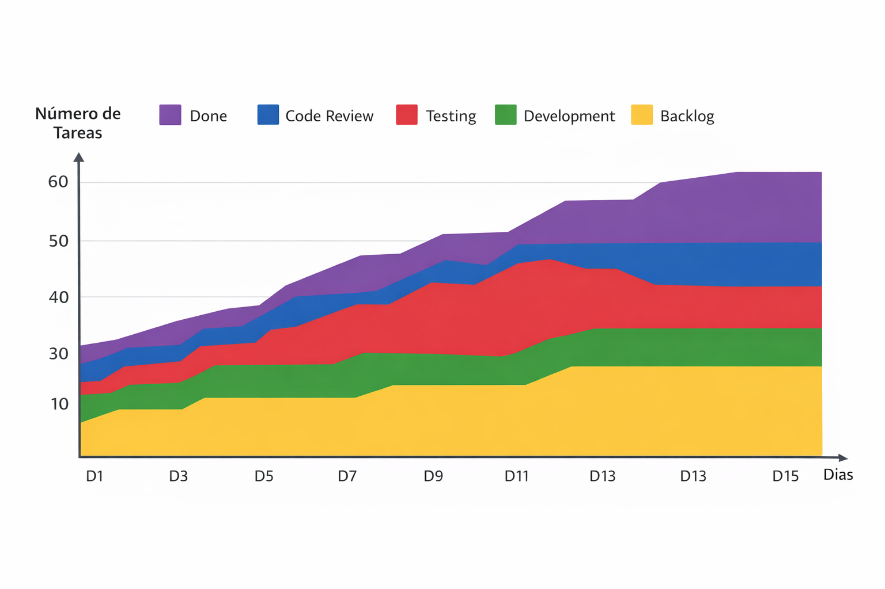

## 🚀 Gestión de Flujo con Kanban en Entornos Reales

Este módulo demuestra cómo implementar Kanban como sistema de gestión de flujo en equipos de desarrollo de software, enfocado en la optimización de entrega continua, reducción de cuellos de botella y toma de decisiones basada en métricas.

Se basa en prácticas aplicadas en contextos reales de transformación ágil.

El enfoque está orientado a:

* Visualizar el trabajo end-to-end
* Optimizar el flujo de entrega
* Reducir tiempos de desarrollo
* Tomar decisiones basadas en métricas

---

## 📈 Impacto esperado

La implementación de Kanban como sistema de gestión de flujo permite generar impacto directo en el desempeño del equipo y en los resultados del producto:

- Reducción del Lead Time
- Disminución del Cycle Time
- Mejora en la predictibilidad de entrega
- Identificación temprana de cuellos de botella
- Incremento del throughput del equipo
- Optimización del uso de capacidad

👉 Este enfoque permite evolucionar desde la gestión de tareas hacia la optimización del sistema de trabajo.

---

## 🧩 Caso aplicado

Se desarrolla un caso práctico basado en una:

👉 **App de aprendizaje de inglés para niños de 3 a 8 años**

Objetivos del producto:

* Mejorar la experiencia de aprendizaje
* Incrementar el engagement mediante interacciones
* Aumentar la retención de usuarios

---

## 🧱 Estructura del flujo

El sistema se organiza en un flujo continuo:

```text
Backlog → Ready → Development → Code Review → Testing → QA → Release → Done
```

Este flujo permite gestionar el trabajo de manera progresiva, asegurando calidad en cada etapa.

---

## ⚙️ Componentes del sistema Kanban

Este módulo se compone de cuatro dimensiones principales:

---

### 🧩 1. Diseño del flujo

📄 `diseno_tablero_kanban.md`

* Definición de columnas del tablero
* Estructura del flujo de trabajo
* Ejemplos de historias y tareas reales
* Adaptación a herramientas como Jira / Azure DevOps

---

### 🔄 2. Operación del flujo

📄 `simulacion_flujo_trabajo_jira.md`
📄 `politicas_wip.md`

* Simulación de un tablero en operación real
* Gestión de tareas en distintas etapas
* Aplicación de límites WIP
* Identificación y resolución de bloqueos

👉 Se aplica el principio:
**“Stop starting, start finishing”**

---

### 📊 3. Métricas y mejora

- `metricas_flujo.md`
- `cumulative_flow_explicado.md`

* Medición de Lead Time, Cycle Time y Throughput
* Análisis del flujo mediante métricas
* Identificación de cuellos de botella
* Uso de CFD (Cumulative Flow Diagram)

## 📊 Ejemplo de Cumulative Flow Diagram

<p align="center">
  
</p>

<p align="center">
  <em>Visualización del flujo de trabajo donde se observa la distribución de tareas en cada etapa del proceso.</em>
</p>

### 🔍 Análisis del gráfico

- Se observa acumulación en la etapa de Testing → posible cuello de botella  
- El crecimiento irregular indica variabilidad en el flujo  
- La banda de "Done" muestra la velocidad de entrega del equipo  

👉 Este tipo de análisis permite tomar decisiones para mejorar la eficiencia del sistema.

👉 Enfoque data-driven para optimizar el sistema

---

### 🚀 4. Caso práctico aplicado

📄 `caso_practico_kanban_app_ingles.md`

* Implementación completa del sistema Kanban
* Problemas reales del flujo
* Decisiones del equipo
* Resultados obtenidos

---

## 🔍 Ejemplo de situación real

Durante la operación del tablero:

* Testing alcanza su límite WIP
* Code Review se satura
* Development continúa iniciando trabajo

👉 Resultado:

* Aumento del Cycle Time
* Flujo inestable

---

## 🛠️ Acciones implementadas

* Reducción del WIP en Development
* Priorización de tareas bloqueadas
* Apoyo del equipo en Testing
* Ajuste del flujo de trabajo

---

## 📈 Resultados obtenidos

* Reducción de tiempos de entrega
* Flujo más estable y predecible
* Disminución de bloqueos
* Mejora en la calidad del producto

---

## 📊 Impacto en el producto

* Mayor velocidad de entrega de funcionalidades
* Mejor experiencia de usuario
* Incremento en uso de la aplicación
* Mayor satisfacción de usuarios (niños y padres)

---

## 💼 Enfoque profesional

Este módulo refleja prácticas utilizadas en entornos reales de desarrollo:

* Gestión de delivery end-to-end
* Optimización del flujo de trabajo
* Uso de métricas para toma de decisiones
* Alineación entre desarrollo y objetivos de negocio

---

## 🔥 Insight clave

> No se trata de gestionar tareas…
> sino de gestionar cómo fluye el trabajo.

---

## Conclusión

Kanban no solo permite visualizar tareas; permite gestionar el sistema de trabajo, estabilizar el flujo y mejorar la capacidad de entrega de valor.

En este módulo, el enfoque está puesto en cómo transformar la operación del equipo a través de decisiones basadas en flujo, límites WIP y métricas.
