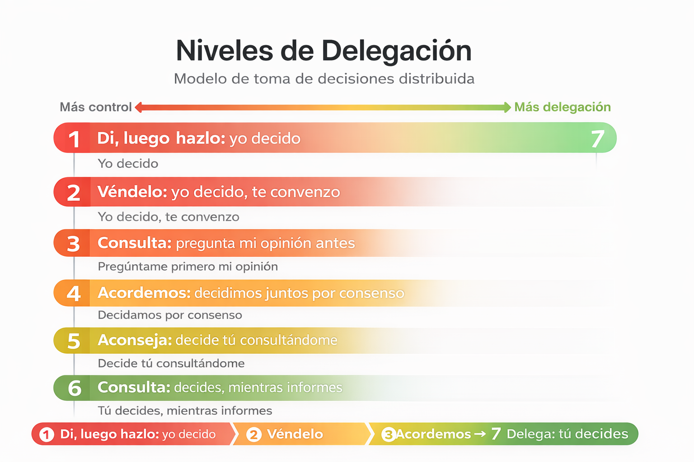

# 🎨 Visuales Management 3.0

Esta carpeta contiene representaciones visuales de prácticas de liderazgo ágil basadas en Management 3.0.

Estas visualizaciones permiten comprender de forma rápida conceptos clave utilizados en la gestión de equipos y toma de decisiones.

---

## 📌 Contenido

### 🔹 Niveles de Delegación

Modelo de toma de decisiones distribuida que define el grado de autonomía del equipo.

---

### 🔹 Motivadores Intrínsecos *(próximamente)*

Factores que influyen en la motivación de los equipos y su desempeño.

---

### 🔹 Reconocimiento (Kudo Cards) *(próximamente)*

Prácticas para fortalecer la cultura de feedback positivo y reconocimiento.

---

## 🎯 Objetivo

Facilitar la aplicación práctica de conceptos de liderazgo ágil mediante representaciones visuales, permitiendo una mejor comprensión y adopción en equipos reales.
